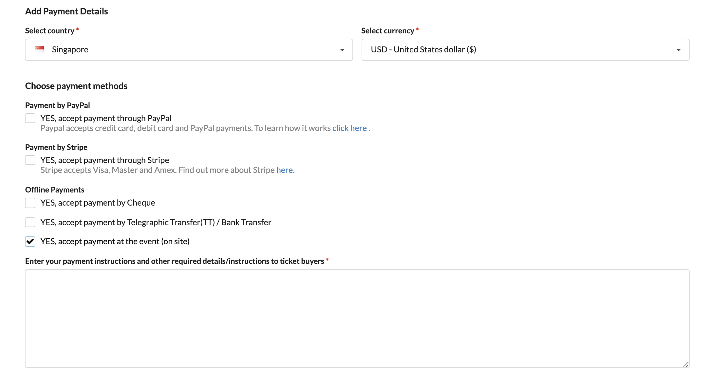
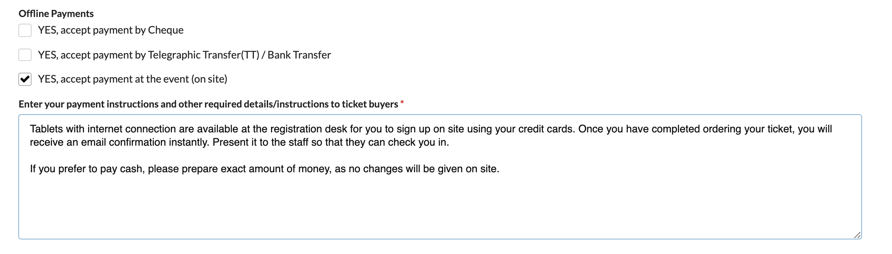
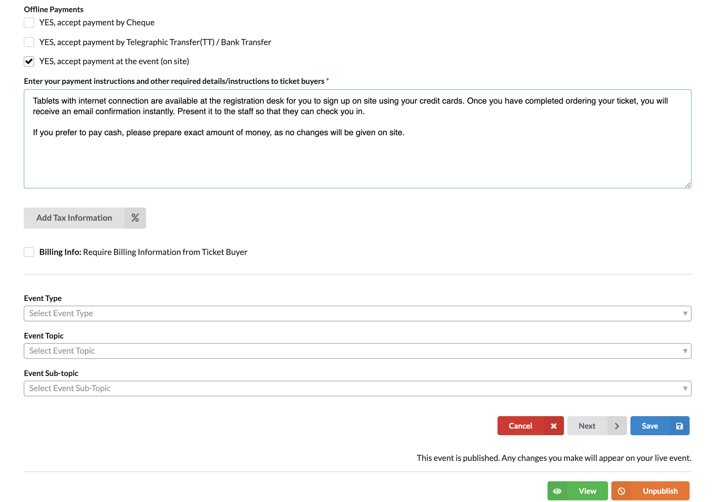

# How do I accept on-site payments at the door for tickets? 

First of all, you need to complete configuring your **Ticketing System** (including ticket types, prices and quantity) before adding different payment options for your event. Check out this article to learn [how to set up your tickets](http://support.eventyay.com/tickets-payments/How-do-I-sell-tickets-online.html). 

Once you have done the first step, scroll down to **Choose payment methods** and tick on `YES, accept payment at the event (on site)` under **Offline Payments**.

Then, fill in instructions for on-site payment. An example as below: 

Once you're done, click `Save` to save your changes. You can also preview the changes in draft stage, simply by clicking `View` button. 

