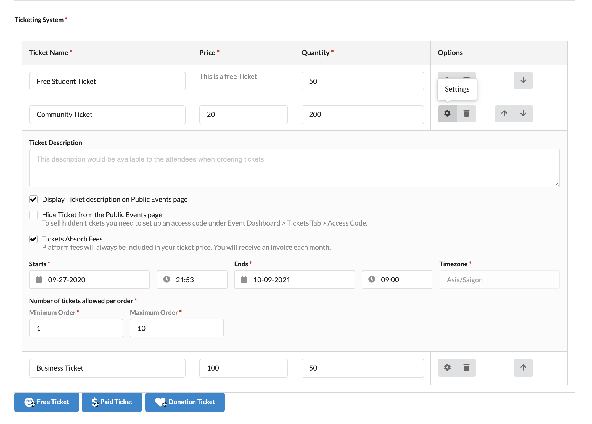
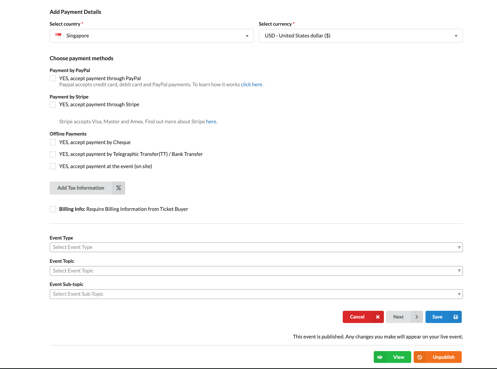

# How do I sell tickets online?

You need to create an event before you can start selling tickets online. To learn how to create an event, check out [How can I create an event on Eventyay](http://support.eventyay.com/event-setup/How-can-I-create-an-event.html). Once you have done so, follow these steps to set up tickets and payment for your event. 

1. Log in to your acocunt on **Eventyay**. Then select `Manage Events` from the dropdown menu under your profile. 

    

2. Go to the event you want to sell tickets and click on `Edit`.

    

3. You will be directed to a page where you can edit `Basic Details` for your event. Scroll down to `Ticketing System`. There are 3 different ticket categories you can choose from: **Free Ticket**, **Paid Ticket** and **Donation Ticket**. You can add different ticket types for each category, as below: 

    

Make sure to provide input for all required fields, including: `Ticket name`, `Price` (except for **Free Ticket**) and `Quantity`. Then you can click on `Settings` to configure other information (of each ticket) as in below: 

*Notice:* 

- Platform fees will always be included for paid tickets. 
- You need to set the **start/end** - **date/time** for your tickets correctly. 
- You can control how many tickets can be purchased in one order by setting the **min/max** number. 

4. After setting up `Ticketing System`, you need to `Add Payment Details` (as below) in order to start selling tickets on **Eventyay**. 

    

*Notice:* 
- Select **country** where your payment accounts are registered in and select the **currency** you want to apply for your tickets.
- Choose payment methods: **online/offline** or both and follow instruction in each method to complete the set-up.
- Add **tax information** if needed 

After you finish, click `Save` to save your changes or publish your changes right away using the `Publish` button. You can also preview your changes in draft stage, simply by clicking `View` button. You'll see how your event would look like on the public events page once published.
