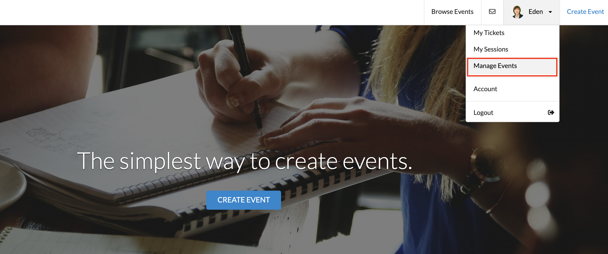
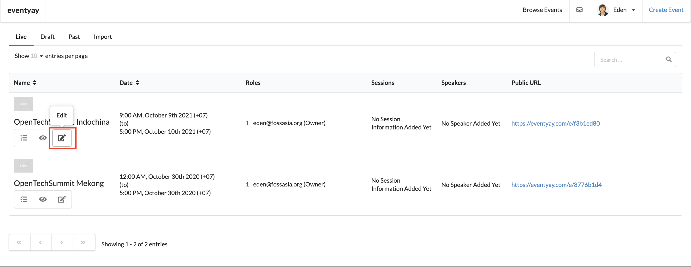
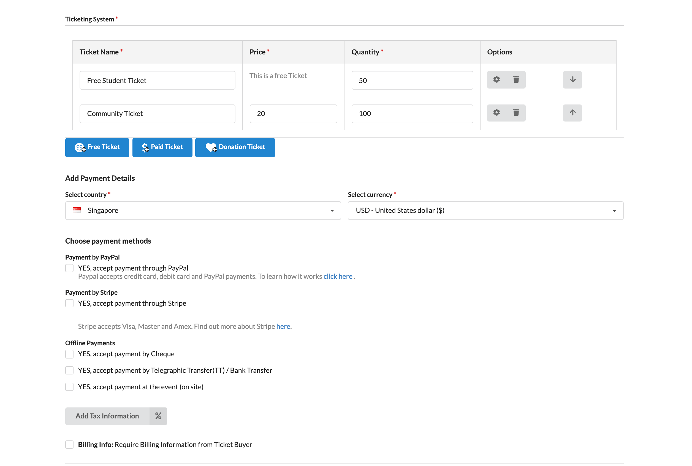
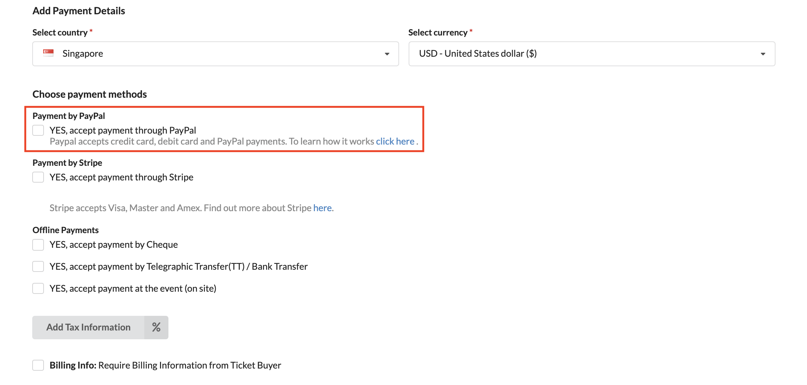
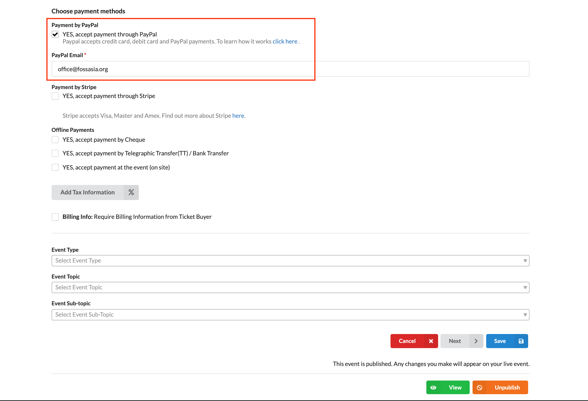
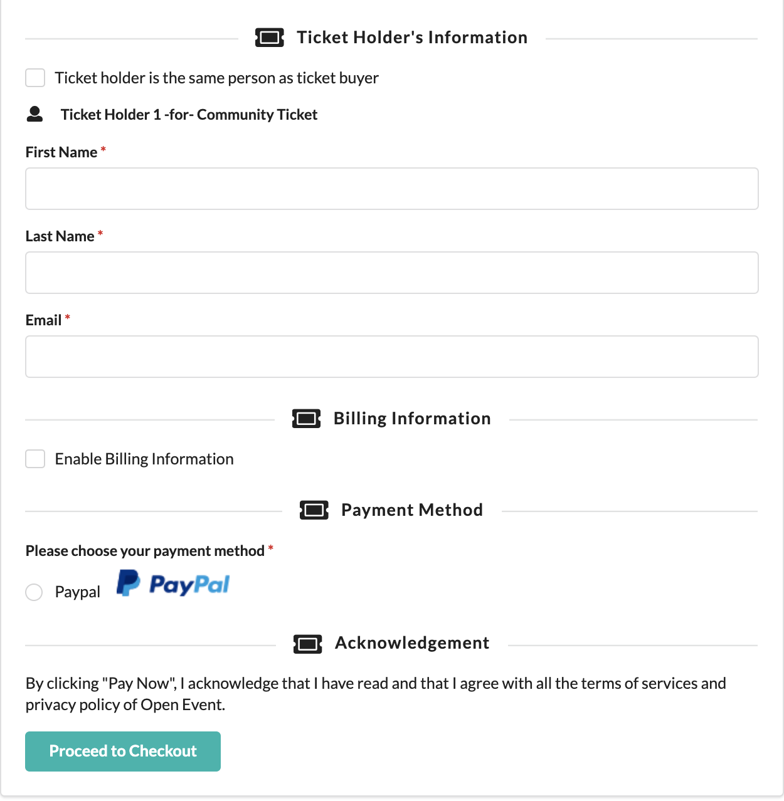
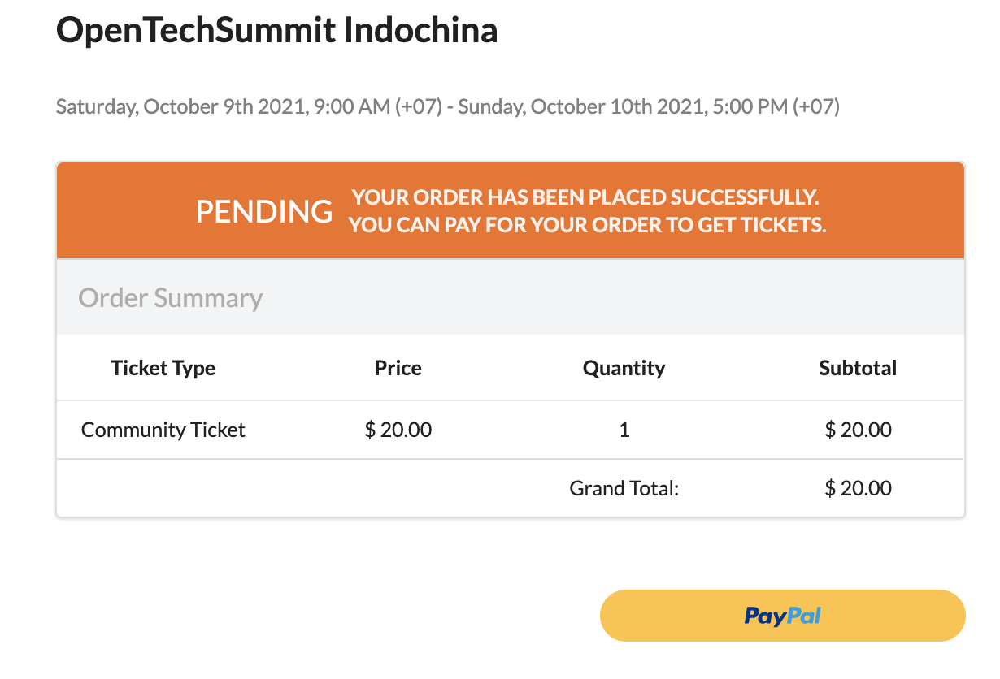

# How do I sell tickets using PayPal?

You need to create an event before you can start selling tickets online. To learn how to create an event, check out [How can I create an event on Eventyay](http://support.eventyay.com/event-setup/How-can-I-create-an-event.html). Once you have done so, follow these steps to set up tickets and payment for your event. 

1. Log in to your acocunt on **Eventyay**. Then select `Manage Events` from the dropdown menu under your profile. 

2. Go to the event you want to sell tickets and click on `Edit`.

3. You will be directed to a page where you can edit `Basic Details` for your event. Scroll down to `Ticketing System` & `Add payment details`. Please set up your paid tickets before adding **payment details**. If you are not sure how to do so, please check out this article: [How do I sell tickets online?](../tickets-payments/How-do-I-sell-tickets-online.md)

4. After setting up your paid tickets, tick on `Payment by Paypal` under `Choose payment methods`.

5. Input the email address associated with your paypal account to collect payment via paypal. 

Once you're done, click `Save` to save your changes or publish your changes right away using the `Publish` button. You can also preview the changes in draft stage, simply by clicking `View` button. 

6. When the changes are published, people will see **Paypal** payment option when ordering tickets for your event. 

7. After filling in ticket holder's information and `proceed to check out`, they'll be directed to the next pay to view their order's summary for the last time. And they can click on the integrated **Paypal** button to complete their order. 

