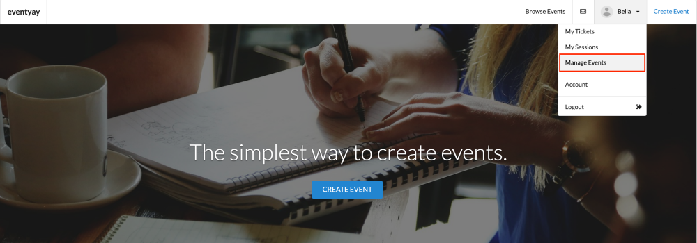
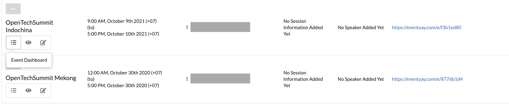
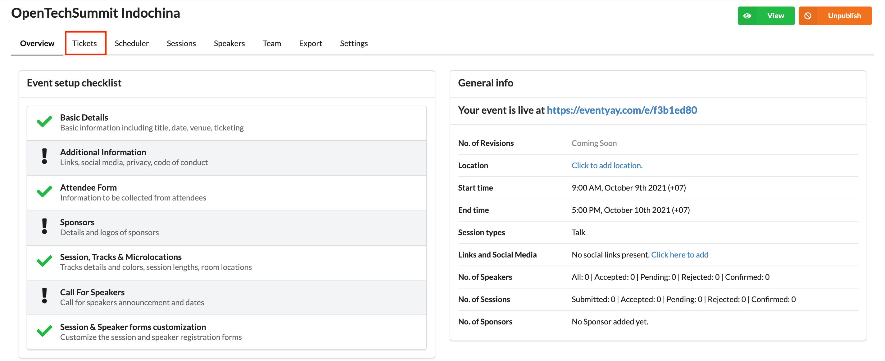
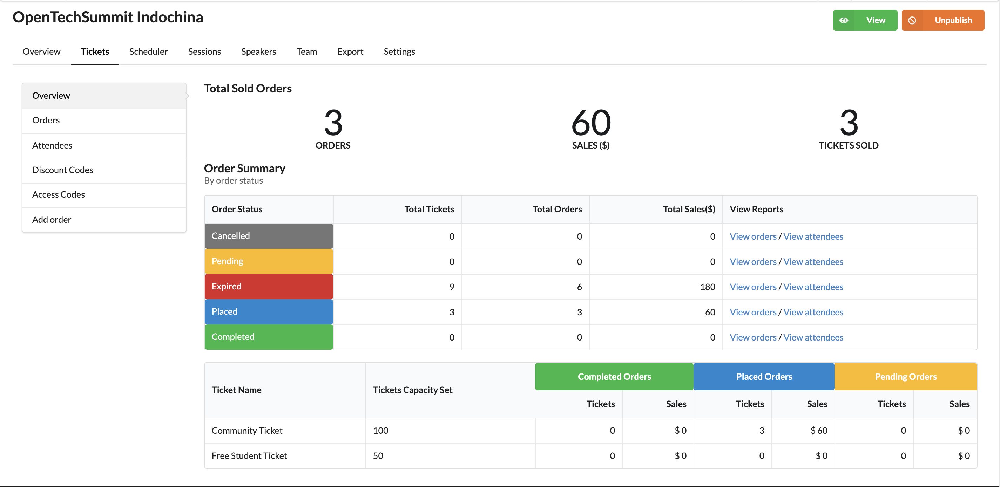
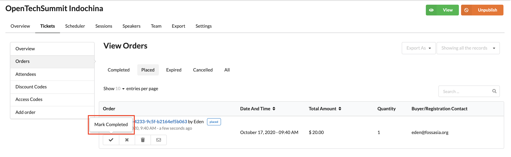

# How to mark offline payment as received?

**Offline payments** are payments made via cheque, bank transfer or on-site. When a ticket is orderd using one of the offline payment options, that ticket will be labeled as `placed` in organizer's dashboard. 

When an offline payment is received, the organizer needs to mark it as received by completing the steps as below.

**Step 1:** Log in to your account on [eventyay](https://eventyay.com/login) then click on `Manage Events` from the drop-down menu under your profile. 

**Step 2:** Go to the event you want to update the payment and click on `Event Dashboard`.

**Step 3:** Click on `Tickets` inside event management dashboard. 

You will be directed to a page with an overview of all your orders. 

**Step 4:** Click on `Orders`, then click to view `Placed` orders. You will see a list of the orders (offline payment) that have been placed. 

**Step 5:** After you have received payment for an order, click `Mark Completed` to update its status. 

**Step 6:** You will be asked to reconfirm your action. Click `Yes` to proceed. 

